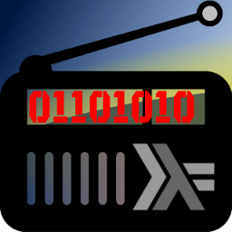
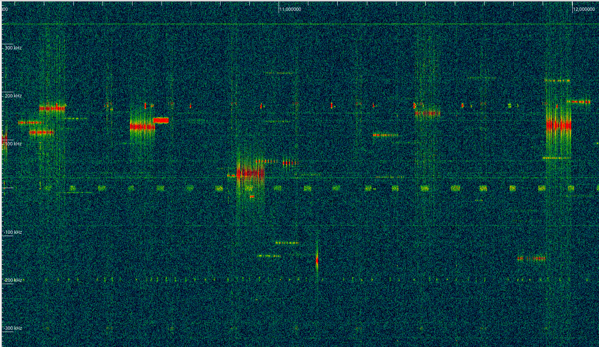
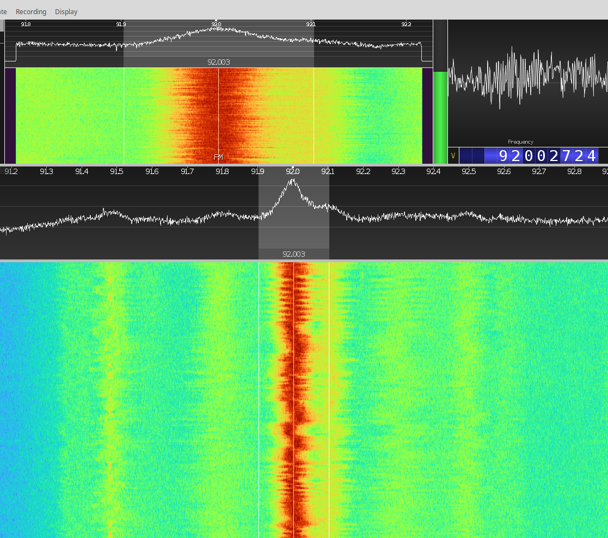
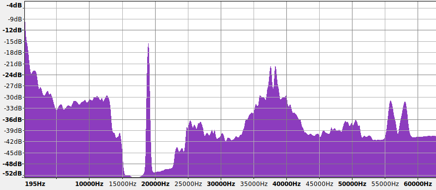
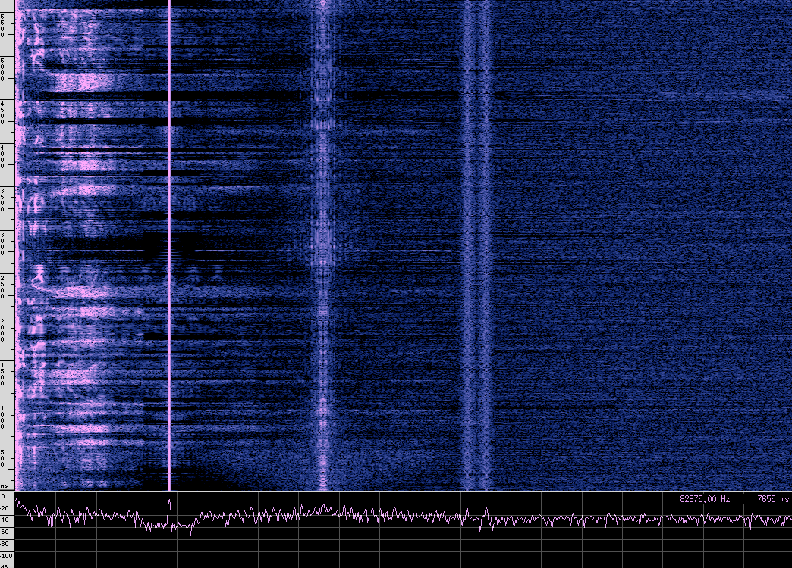
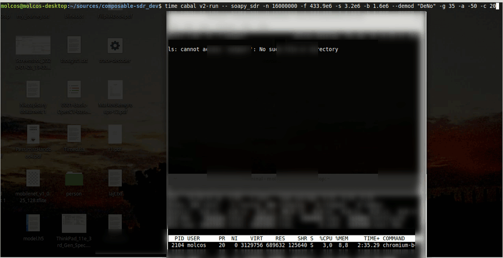

# composable-sdr

DSP processing blocks aimed at SDR, embedded in Haskell.




## Introduction

This repo is aimed at exploring the usefulness of data flow programming for
SDR/DSP processing. It leverages [SoapySDR](https://github.com/pothosware/SoapySDR)
for data sources and [liquid-dsp](https://github.com/jgaeddert/liquid-dsp) for radio
DSP. All those low-level C/C++ libraries are fine for 'programming in the small', but when
'programming in the large' code gets ugly really fast. And here is where Haskell comes in.
The idea is to use C/C++ interop to 'lift' low-level APIs to streams and folds in [Streamly](https://hackage.haskell.org/package/streamly).
The hope is to create a framework in which efficient DSP is possible and without sacrificing
code quality even for complex signal processing flows.

This repo will stay fairly low-level. The applications built using provided processing blocks
should be lean and mean, so that it's possible to deploy them on even not-so-powerful, embedded,
headless systems. All the UI interaction stuff can be always done via sockets and this
is probably one of the best designs for such things.

As of today there is only one fairly minimalistic application implemented, but I
think the approach already shows its benefits. Writing an application with just one set of
functionalities offered by `soapy-sdr`, in an imperative language, would be an accomplishment in itself.
More details below.

## Dependencies

 - [SoapySDR](https://github.com/pothosware/SoapySDR)
 - SoapySDR module(s) like [SoapyRTLSDR](https://github.com/pothosware/SoapyRTLSDR)
 - [liquid-dsp](https://github.com/jgaeddert/liquid-dsp)

Cabal v2 project requires ghc-8.6.5, so before first `cabal v2-build` something like `cabal v2-configure -w /opt/ghc/8.6.5/bin/ghc-8.6.5`
is needed. There is also a `stack.yaml` file available, but might not always be up-to-date, as I'm mostly using
the Cabal v2 setup.

## Libraries and modules

### ComposableSDR

All the C-interop and Streamly streams and folds - one file for now.

## Tools and applications

### soapy-sdr

I/Q recorder and processor using SoapySDR as backend.


```
Usage: soapy-sdr [-f|--frequency DOUBLE] [-s|--samplerate DOUBLE] 
                 [-g|--gain DOUBLE] [-b|--bandwidth DOUBLE] 
                 [-n|--numsamples INT] [-o|--output FILENAME] 
                 [-d|--devname NAME] [--demod ARG] [-a|--agc DOUBLE] 
                 [-c|--channels INT] [-m|--mix]
  Process samples from an SDR retrieved via SoapySDR

Available options:
  -f,--frequency DOUBLE    Rx frequency in Hz (default: 1.0e8)
  -s,--samplerate DOUBLE   Sample rate in Hz (default: 2560000.0)
  -g,--gain DOUBLE         SDR gain level (0 = auto) (default: 0.0)
  -b,--bandwidth DOUBLE    Desired output bandwidth in [Hz] (0 = samplerate = no
                           resampling/decimation) (default: 0.0)
  -n,--numsamples INT      Number of samples to capture (default: 1024)
  -o,--output FILENAME     Output file(s) name (without
                           extension) (default: "output")
  -d,--devname NAME        Soapy device/driver name (default: "rtlsdr")
  --demod ARG              Demodulation type (default: DeNo)
  -a,--agc DOUBLE          Enable AGC with squelch threshold in [dB] (0 = no
                           AGC) (default: 0.0)
  -c,--channels INT        Number of channels to split the signal
                           into (default: 1)
  -m,--mix                 Instead of outputting separate file for each channel,
                           mix them into one
  -h,--help                Show this help text

```

Blue arrows a choices in signal flow. First choice is usage channelizer.
If it's enabled, then the output signals can be written
to separate files, or mixed together and written into one file.
The raw/modulated signal output file format is CF32.
Files can be opened in [inspectrum](https://github.com/miek/inspectrum).

Some captures from ISM 433MHz




AGC with squelch enabled


LoRa on 868MHz


#### Example 1

Let's first check using [CubicSDR](https://cubicsdr.com/) if there are any signals within FM radio band (88-108MHz).



We see a station on 92MHz. Bandwidth of the signal seems to be around 200kHz. Lets record some IQ samples
(2 million sample = 10s of recording, DeNo means no demodulation - output will be CF32 IQ sample file):

```sh
cabal v2-run -- soapy-sdr -n 2000000 -f 92.0e6 -b 200000 --demod "DeNo"
```

Lets now inspect the output file (output.cf32) in [inspectrum](https://github.com/miek/inspectrum).


Now let's record a wideband WAV file with FM demodulated signal:

```sh
cabal v2-run -- soapy-sdr -n 2000000 -f 92.0e6 -b 200000 --demod "DeNBFM 0.6 WAV"
```

Sample rate of this file is 200kHz. Didn't know libsndfile can pull this off :smiley:. On a spectrogram in
[Audacity](https://www.audacityteam.org/) we can clearly see the mono audio below 15kHz, 19kHz stereo pilot, stereo audio
between 23kHz and 53kHz and RDBS around 57kHz.



The same in baudline:



Alright, let's now do proper wide band FM (mono) demodulation with de-emphasis, resampled rate of 192k and output decimation of 4,
to get 48kHz output WAV file:

```sh
cabal v2-run -- soapy-sdr -n 2000000 -f 92.0e6 -b 192000 --demod "DeWBFM 4 WAV"
```

There is also experimental stereo FM decoder:

```sh
cabal v2-run -- soapy-sdr -n 2000000 -f 92.0e6 -b 192000 --demod "DeFMS 4 WAV"
```

It's possible to 'play live' running below commands in a separate terminal:

```sh
rm output*; mkfifo output.au && play output.au
```
and then starting `soapy-sdr`, but with AU audio format set.

#### Example 2

To run as a [PMR446](https://en.wikipedia.org/wiki/PMR446) scanner:

```sh
cabal v2-run -- soapy-sdr -n 2000000 -f 446.1e6 -b 200000 -c 16 -s 1.0e6 --demod "DeNBFM 0.3 WAV" -g 40 -a -16
```

This will output 16 WAV files, each for one PMR channel. To merge all the files into one `-m` flag can be used:
There is also AGC with squelch (`-a` option), but needs more testing and adding auto mode.

#### Example 3

Just a general demonstration of precision and efficiency. We're switching the SDR to 3.2MSPS.
Then resample the signal to 1.6MSPS and channelize to 20 channels, writing to 20 separate files.
We request 16M sample (after resampling), so around 10s of recording:

```sh
time cabal v2-run -- soapy-sdr -n 16000000 -f 433.9e6 -s 3.2e6 -b 1.6e6 --demod "DeNo" -g 35 -a -50 -c 20
```

Below is a GIF showing how the files are written and CPU utilization. No samples are lost and each file
ends up 6400000 bytes long. One CF32 sample is 8 bytes, so at 3.2MSPS we're capturing around 24MB/s.
Then processing it and saving around 122MB in 10 seconds.



## TODO
  - [ ] add live playback via PulseAudio
  - [ ] add RF protocol decoders
  - [ ] profile flows and introduce concurrency modifiers (`aheadly`, etc.)
  - [ ] Template Haskell boilerplate code generator for Liquid-DSP blocks
  - [ ] general cleanup - some structure is already emerging, so moving things to separate modules would be in order
